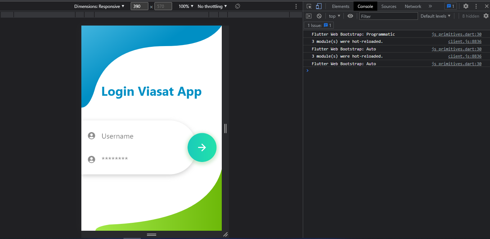
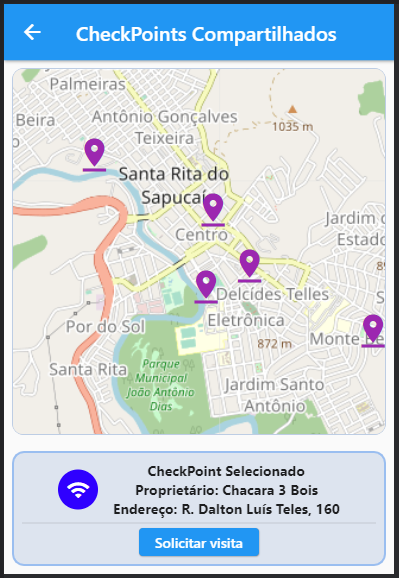
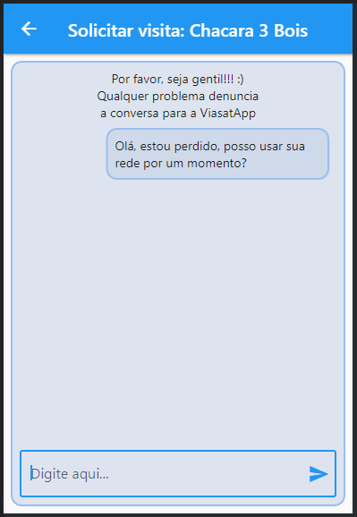

# app_challenge


Como rodar o projeto

**Step 1:**

Baixe ou clone este repositorio pelo link abaixo:

```
https://github.com/AdsonFS/app_challenge_2022.git
```

**Step 2:**

Vá para a raiz da aplicação e execute o comando no cmd para obter as dependêcias: 

```
flutter pub get 
```

**Step 3:**

Finalmente, para rodar o projeto em sua maquina, execute: 
```
flutter run -d chrome
```

**Step 4:**
Observação para a avaliação do projeto:
Em minha máquina não foi possível usar o emulador, então ao executar, por favor use clique com o botão direito, **inspencionar** e clique em **Toggle Device Toolbar**
Isso é necessário porque o app pode não funcionar como esperado pelo celular ou pelo navegador com uma largura grande, agradeço a compreensão! :)



## Detalhes fora do escopo do desafio

#### Escolha da linguagem
Eu não sou programador front-end, por isso optei por flutter ao invés de React, apesar de possuir o mesmo nivel de conhecimento basico nos dois frameworks, acredito que Flutter tem uma facilidade maior, por conseguir tratar todos os componentes apenas com linguagem de programação, sem usar linguagens de marcação que acrescenta mais um desafio no uso.

#### Tela de CheckPoints Compartilhados
A Viasat se mostrou uma empresa que valoria bastante os valores sociais, como foi demonstrado na apresentação de abertura do App Challenge Inatel, e tambem no site, com o projeto de [Internet Comunitária](https://www.viasat.com/pt-br/internet-comunitario/internet-para-todos/).
Então, com o objetivo de ajudar a empresa a materializar seus valores, eu criei a funcionalidade dos usuarios da zona rural disponibilizar sua rede de internet para pessoas da regiam que também necessitam, afinal, a cobertura de operadores de celulares em zonas rurais é por vezes falha. Desse modo, tanto a ViasatApp como os proprios usuarios podem ajudar a sua cominidade local.




Ao clicar em **Solicitar Visita**, o usuário se conecta com o proprietário da rede.